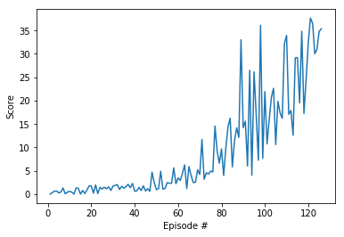

### Report for Project 2 - Continuous Control

## Learning Algorithm

The learning algorithm used was a Deep Deterministic Policy Gradient (DDPG) using an Actor-Critic model with underlying neural networks. Each network used two fully connected layers with 128 units each, relu activation functions, batch normalization prior to each linear layer for the actor and prior to the first fully-connected layer for the critic. Xavier initialization was used, which substantially improved performance.

The hyperparameters used to train the agent were as follows:
- BUFFER_SIZE = int(1e6)  (replay buffer size)
- BATCH_SIZE = 256        (minibatch size)
- GAMMA = 0.99            (discount factor)
- TAU = 1e-3              (for soft update of target parameters)
- LR_ACTOR = 1e-3         (learning rate of the actor)
- LR_CRITIC = 1e-3        (learning rate of the critic)
- WEIGHT_DECAY = 0        (L2 weight decay)
- OU_SIGMA = 0.1          (Ornstein-Uhlenbeck noise parameter, volatility)
- OU_THETA = 0.12         (Ornstein-Uhlenbeck noise parameter, speed of mean reversion)

## Plot of Rewards

The following is a plot of the rewards for the trained agent showing the 126 episodes it took to solve the problem. Over the last 100 episodes, the average score was 31.44:

## Ideas for Future Work

My initial implementation took prohibitively long to solve the task, even with GPU (>12 hours). Addition of batch normal and modified initial weights were used to improve solution time substantially. Future work could include letting this model train for longer to see if it could reach an even higher score within a reasonable time. This solution could also be extended to the multi-agent task, and was ultimately adapted as a starting place for the Collaboration and Competition task.

